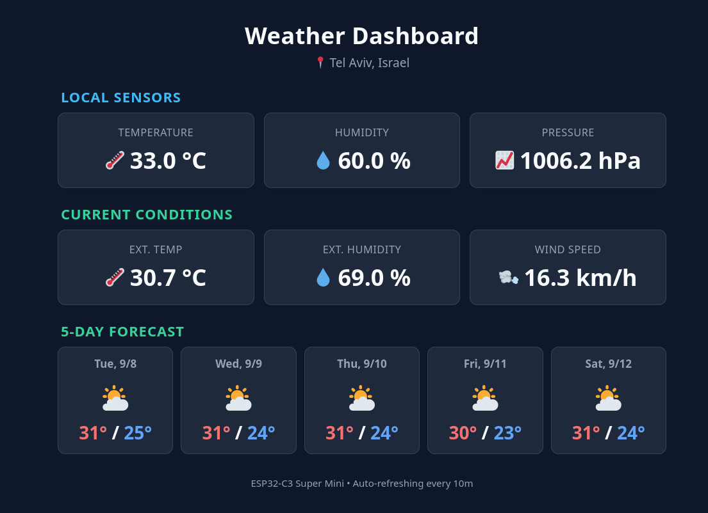
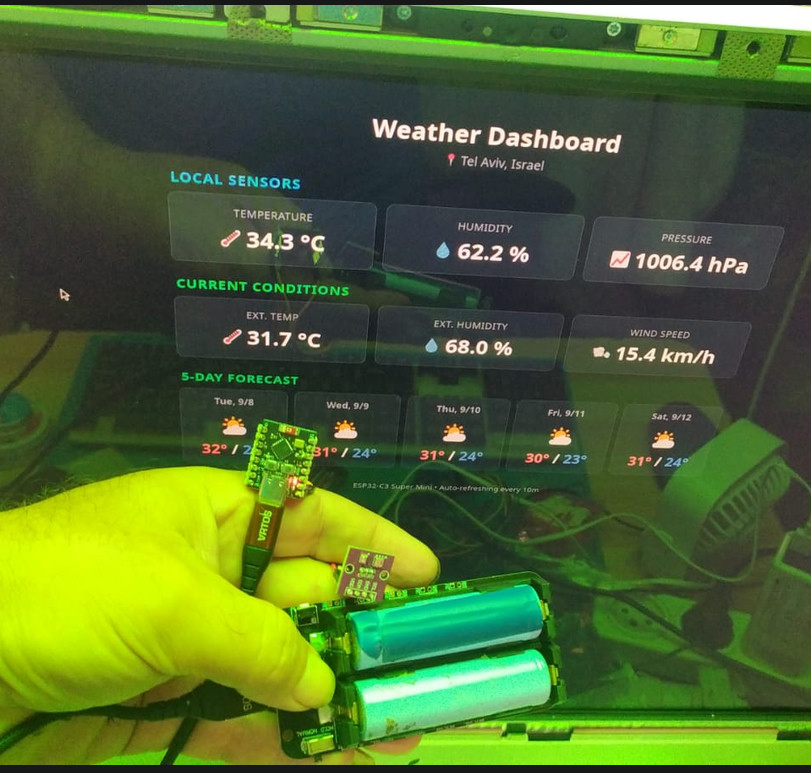

# ESP32-C3 Weather Dashboard

A lightweight, non-blocking IoT weather station powered by an ESP32-C3 Super Mini. It integrates local telemetry from an I2C sensor module with multi-day forecasts from the Open-Meteo API, serving a self-contained dark-mode dashboard directly from the microcontroller.

<p align="left">
  
  
  
  
</p>
---
## 📸 Preview

**Web Dashboard UI**


**Hardware Assembly**
*ESP32-C3 microcontroller connected to the AHT20 and BMP280 I2C sensor module, powered by a standalone 18650 battery setup.*


## Hardware Architecture & Pinout

The system runs on low-cost hardware utilizing an ESP32-C3 RISC-V microcontroller coupled with an AHT20 and BMP280 environmental sensor array over the I2C bus.

| ESP32-C3 Pin | Module Pin | Description |
| :--- | :--- | :--- |
| **3.3V** | VCC | Regulated Power Supply *(Do not use 5V)* |
| **GND** | GND | Common Ground |
| **GPIO 4** | SDA | I2C Serial Data |
| **GPIO 5** | SCL | I2C Serial Clock |

---

## Engineering Highlights

* **Non-Blocking Execution Flow:** Replaces blocking `delay()` routines with asynchronous non-blocking interval checks via `millis()`, ensuring the web server remains fully responsive during network operations.
* **Zero External CDNs:** The front-end user interface (HTML5, CSS3, and Vanilla JavaScript) is embedded natively within the firmware flash, allowing the device to operate entirely offline.
* **Graceful Degradation:** Designed for robust fault-tolerance. If physical sensors are disconnected or fail to initialize, the JSON serialization layer safely returns structured `null` payloads instead of throwing exceptions or propagating floating data.
* **Efficient Payload Caching:** External API responses are polled asynchronously in the background at configurable intervals (default: 10 minutes) to prevent memory fragmentation and rate-limiting.

---

## Getting Started

1. Clone or download this repository.
2. Create a `secrets.h` configuration file inside the `include/` directory:
   ```cpp
   #ifndef SECRETS_H
   #define SECRETS_H

   const char* ssid = "YOUR_WIFI_SSID";
   const char* password = "YOUR_WIFI_PASSWORD";
   const float WEATHER_LAT = 32.0853; // Default: Tel Aviv, Israel
   const float WEATHER_LON = 34.7818;

   #endif

3. Build and flash the firmware using PlatformIO with the appropriate USB-CDC communication flags.\
   Open your **Serial Monitor** (115200 baud) immediately after booting to check the local IP address assigned by your router.

## Tech Stack & Dependencies

* **Core Framework:** Arduino (ESP32 Core)
* **Build Environment:** PlatformIO
* **Network Stack:** ESPAsyncWebServer, HTTPClient
* **Data Interchange:** ArduinoJson
* **Sensor Drivers:** Adafruit_AHTX0, Adafruit_BMP280